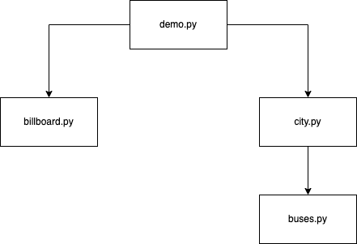

# CineBus

*Tria pel·li i vés-hi en bus!* 🚌 🎞️


## Introducció

Aquesta pàgina descriu el projecte CineBus, que correspon a la segona pràctica del curs 2023 d'AP2 al GCED. La vostra tasca consisteix en implementar la part relativa a les dades, algorismes i visualització d'un sistema que permeti als barcelonins trobar una pel·lícula d'acord a les seves preferències i ensenyar-los com arribar al cinema que la mostri el més aviat possible en desplaçaments en bus i a peu.

Per realitzar aquesta pràctica haureu d'integrar aquestes dades:

- El mapa dels carrers de Barcelona obtingut d'[Open Street Map](https://www.openstreetmap.org).

- La [Informació de companyies, línies i recorreguts](https://www.ambmobilitat.cat/OpenData/ObtenirDadesAMB.json) del [Catàleg OpenData de l'Àrea Metropolitana de Barcelona](https://www.amb.cat/s/web/area-metropolitana/dades-obertes/cataleg-opendata.html).

- Alguna cartellera de cinema, com ara la de [Sensacine](https://www.sensacine.com/cines/cines-en-72480/).


## Arquitectura del sistema

Els sistema consta dels mòduls següents:

- `billboard.py` conté tot el codi relacionat amb l'obtenció de la cartellera i cerques relacionades.

- `buses.py` conté tot el codi relacionat amb la construcció del graf de busos.

- `city.py` conté tot el codi relacionat amb la construcció del graf de ciutat i la cerca de rutes entre punts de la ciutat.

- `demo.py` conté un programa de demostració i utilitza els mòduls `city` i `billboard`. 

Els diagrama de mòduls següents mostra les relacions d'ús entre aquests mòduls:





## Mòdul `billboard`

La funció principal d'aquest mòdul és llegir les dades relatives a la cartellera de cinemes de Barcelona del dia actual i cercar-les. 

La lectura de la cartallera ha de generar una dada de tipus `Billboard`, que té tres camps: 

- `films` enmagatzema les pel·lícules disponibles,
- `cinemas` enmagatzema les sales de cinema disponibles,
- `projeccions` enmagatzema les projeccions (sessions) de pel·lícules en sales, juntament amb la seva hora.

La informació de cada pel·lícula s'ha de desar en una dada de tipus `Film`. Per exemple,

```python3
@dataclass 
class Film: 
    title: str
    genre: str
    director: str
    actors: list[str]
    ...
```

La informació de cada sala s'ha de desar en una dada de tipus `Cinema`. Per exemple,

```python3
@dataclass 
class Cinema: 
    name: str
    address: str
    ...
```

La informació de cada sessió s'ha de desar en una dada de tipus `Projection`. Per exemple,

```python3
@dataclass 
class Projection: 
    film: Film
    cinema: Cinema
    time: tuple[int, int]   # hora:minut
    language: str
    ...
```

Així, la classe `Billboard` podria tenir aquests atributs i mètodes:

```python3
@dataclass 
class Billboard: 
    films: list[Film]
    cinemas: list[Cinema]
    projections: list[Projection]
```

La funció `read` del mòdul `billboard.py` ha de descarregar les dades necessàries per retornar la cartellera del dia actual:

```python3
def read() -> Billboard: ...
```

A més, la classe `Billboard` ha de proporcionar mètodes per poder-hi cercar informació. Per exemple, podria haver-hi un mètode que, donat un mot, retornés totes les projeccions de pel·lícules que inclouen aquell mot al seu títol. Opcionalment, podeu afegir-hi més mètodes de consulta, per exemple per trobar pel·lícules a través de filtres com el seu gènere, el seu director, els seus actors...


## Mòdul `buses`

La funció principal d'aquest mòdul és crear un **graf de busos** a partir de les dades de la informació de les línies d'autobusos i les seves parades. Un graf de busos conté informació sobre les parades, les línies i els trajectes dels autobusos. 

En un graf (no dirigit) de busos, els nodes es corresponen a les parades i els arcs als trajectes entres dues parades consecutives d'una mateixa línia de bus. Els nodes han de tenir atributs per desar-hi el nom de la parada, les seves coordenades, ètc. Els arcs han de tenir atributs per desar-hi, per exemple, la línia del bús que els serveix.

El mòdul `busos` ha d'oferir la funció

```python3
def get_buses_graph() -> BusesGraph: ...
```

que descarrega les dades de l'AMB i retorna un graf no dirigit a partir del contingut. El tipus `BusesGraph` no és altra cosa que un graf no dirigit de networkx:

```python3
BusesGraph : TypeAlias = networkx.Graph
```


Finalment, aquest mòdul també ha d'oferir dues funcions per dibuixar mapes:

```python3
def show(g: BusesGraph) -> None: ...
def plot(g: BusesGraph, nom_fitxer: str) -> None: ...
```

La primera mostra el graf interactivament usant `networkx.draw`.
La segona desa el graf com una imatge amb el mapa de la ciutat de fons en l'arxiu especificat a `nom_fitxer` usant `staticmaps`.


## Mòdul `city`

El mòdul `city` és el responsable de proporcionar el **graf de ciutat** que representarà tota la informació necessària per saber anar d'una cruïlla de la ciutat de Barcelona a una altre de la forma més ràpida possible a peu o en bus. El graf de ciutat serà un graf no dirigit resultat de la fusió de dos altres grafs: el graf dels carrers de Barcelona (que proporciona el mòdul `osmnx`) i el graf de busos (que proporciona el mòdul `buses`). El graf de ciutat serà del tipus

```python3
CityGraph : TypeAlias = networkx.Graph
```

i cada aresta tindrà un atribut `info` de tipus `Edge` que heu de definir vosaltres amb els camps rellevants.

El graf de carrers de Barcelona l'obtindrem amb la funció:

```python3
def get_osmnx_graph() -> OsmnxGraph: ... 
```
a on un `OsmnxGraph` no és més que:

```python3
OsmnxGraph : TypeAlias = networkx.MultiDiGraph
```

és a dir, un graf dirigit multi-arc. Això vol dir que dos nodes *u*, *v* poden estar connectats per diversos arcs *(u, v)*.  

Obtenir el graf de carrers a través del mòdul `osmnx` és una operació llarga. Per tal d'anar ràpid, el primer cop que es demani el graf de carrers l'obtindrem a través d'`osmnx` i l'enmagatzemarem en un fitxer. A partir d'aquí, si es demana un altre cop pel graf, l'obtindrem llegint el fitxer a on estan les seves dades. Les funcionalitats que ens permetran guardar i recuperar del disc són:

```python3
def save_osmnx_graph(g: OsmnxGraph, filename: str) -> None: ...
    # guarda el graf g al fitxer filename
def load_osmnx_graph(filename: str) -> OsmnxGraph: ...
    # retorna el graf guardat al fitxer filename
```

Useu el format `pickle` de Python per escriure i llegir grafs i la funció `os.path.exists` per saber si un fitxer existeix.

El `CityGraph` el construirà la funció:

```python3
def build_city_graph(g1: OsmnxGraph, g2: BusesGraph) -> CityGraph: ...
    # retorna un graf fusió de g1 i g2
```

El `CityGraph` resultant tindrà com a nodes la unió de nodes del `OsmnGraph` (que seran de tipus `Cruilla`) i del `BusesGraph` (que seran de tipus `Parada`). Les seves arestes són les que hi ha al `OsmnxGraph` (que seran de tipus `Carrer`) i les del `BusesGraph` (que seran de tipus `Bus`). A més, cal connectar cada node `Parada` amb el node més proper de tipus `Cruilla`. Aquestes arestes seran de tipus `Carrer`. Totes les arestes han de tenir una longitud. Per les arestes de `Carrer`, la seva longitud és la que Osmnx ja reporta; per les arestes de `Bus`, convindrem que la seva longitud és el camí més curt entre els dos nodes més propers a les seves dues parades. Per les arestes entre cruïlles i parades, es pot posar la seva distància  avol d'ocell ja que no seràn mai massa lluny.

Gràcies al `CityGraph` sabrem com anar el més ràpid possible des d'un punt de la ciutat a un altre. Fixeu diferents velocitats per travessar arestes de carrer o de bus i documenteu-ho adientment. 

Per simplificar la pràctica, suposarem que el temps necessari per agafar un bus o canviar de bus és sempre zero (sempre hi ha busos!). Opcionalment, podeu fer que el temps per esperar un bus sigui algun valor constant (això afegeix complexitat a la construcció del graf).

Els punts s'indicaran amb coordenades:

```python3
Coord : TypeAlias = Tuple[float, float]   # (latitude, longitude)
```

i la funció que ens donarà el camí més curt en temps és:

```python3
def find_path(ox_g: OsmnxGraph, g: CityGraph, src: Coord, dst: Coord) -> Path: ...
```

on `Path` és alguna estructura de dades adient.

Utilitzeu funcions del tipus `osmnx.distance.nearest_nodes` per trobar els nodes més propers a les coordenades.

El mòdul `city` també ha d'oferir les funcionalitats següents per mostrar mapes:


```python3
def show(g: CityGraph) -> None: ...
    # mostra g de forma interactiva en una finestra
def plot(g: CityGraph, filename: str) -> None: ...
    # desa g com una imatge amb el mapa de la cuitat de fons en l'arxiu filename
def plot_path(g: CityGraph, p: Path, filename: str, ...) -> None: ...
    # mostra el camí p en l'arxiu filename
```


## Funcionalitat del mòdul `demo`

El mòdul `demo` conté un petit programa principal per provar les funcionalitats dels altres mòduls utilitzant un simple sistema de menús. Aquestes són les funcionalitats mínimes que hauria de tenir:


- mostrar el nom dels autors del projecte.
- crear la cartellera.
- mostrar el contingut de la cartellera.
- cercar a la cartellera.
- crear el graf de busos.
- mostrar el graf de busos.
- crear el graf de ciutat.
- mostrar el graf de ciutat.
- mostrar el camí per anar a veure una pel·lícula desitjada des d'un lloc donat en un moment donat. De totes les projeccions possibles cal mostrar el camí per arribar a la que comenci abans (i que s'hi pugui arribar a temps a peu i en bús).


## Llibreries

Utilitzeu les llibreries de Python següents:

- `requests` per baixar-vos fitxers de dades.
- `beatifulsoup` per llegir els arbres HTML.
- `networkx` per a manipular grafs.
- `osmnx` per a obtenir grafs de llocs (Barcelona en aquest cas).
- `haversine` per a calcular distàncies entre coordenades.
- `staticmap` per pintar mapes.

Totes es poden instal·lar amb `pip3 install`.

Podeu utilitzar lliurament altres llibreries estàndards de Python. Si voleu usar llibreries no estàndards, heu de demanar permís als vostres professors (que segurament no us el donaran).


## Fonts d'informació

Aquests enllaços us seran útils per fer el vostre projecte:

- [Lliçons de fitxers en Python](https://lliçons.jutge.org/python/fitxers-i-formats.html)

- [Python Pickle Module for saving Objects by serialization](https://pythonprogramming.net/python-pickle-module-save-objects-serialization/)

- [Tutorial de NetworkX](https://networkx.github.io/documentation/stable/tutorial.html)

- [Tutorial d'OSMnx](https://geoffboeing.com/2016/11/osmnx-python-street-networks/)

- [Tutorial de Requests](https://realpython.com/python-requests/)

- [Data Science Essentials: Scraping Data From the Web](https://medium.com/swlh/data-science-essentials-scraping-data-from-the-web-3c84e194538d)


## Indicacions per treballar amb els grafs d'OSMnx

Els grafs d'OSMnx contenen molta informació. Per facilitar-vos la feina, demaneu-los simplificats. Així:

```python3
graph = osmnx.graph_from_place("Barcelona", network_type='walk', simplify=True)
```

Aquesta és la manera de recórrer totes les arestes d'un OSMnx graf:

```python3
# for each node and its neighbours' information ... 
for u, nbrsdict in graph.adjacency():
    print(u, nbrsdict)
    # for each adjacent node v and its (u, v) edges' information ...
    for v, edgesdict in nbrsdict.items():
        print('   ', v)
        # osmnx graphs are multigraphs, but we will just consider their first edge
        eattr = edgesdict[0]    # eattr contains the attributes of the first edge
        # we remove geometry information from eattr because we don't need it and take a lot of space
        if 'geometry' in eattr:
            del(eattr['geometry'])
        print('        ', eattr)
```

Com els grafs d'OSMnx tenen multi-arestes, el codi anterior les ignora tot quedant-se amb la primera aresta. Feu el mateix. 

El codi anterior també mostra com eliminar de la informació de la primera aresta la geometria dels camins, ja que en aquest projecte no ens interessa. Si voleu eliminar aquesta informació de totes les arestes (potser abans de guardar el graf en un fitxer) podeu fer:

```python3    
for u, v, key, geom in graph.edges(data = "geometry", keys = True):
    if geom is not None:
        del(graph[u][v][key]["geometry"])
```

Compte: a vegades hi ha sorpreses: carrers amb més d'un nom, valors absents o nuls ...


## Indicacions per obtenir la cartellera (web scraping)

Podeu utilitzar qualsevol font reputable per obtenir la cartellera de cines a Barcelona. Una possible forma de fer-ho és a través de Sensacine. Hi ha tres pàgines HTML amb la informació de Barcelona:

- https://www.sensacine.com/cines/cines-en-72480/?page=1
- https://www.sensacine.com/cines/cines-en-72480/?page=2
- https://www.sensacine.com/cines/cines-en-72480/?page=3

Examineu el seu codi font, veureu que la informació hi apareix molt formatejada però que cada entrada està delimitada per uns elements `<div class="item_resa">`, i que a dins seu hi ha uns atributs `data-theater`, `data-movie` i `data-times` que contenen les dades en format JSON. Amb BeautifulSoup podeu seleccionar els `item_resa` i, per a cadascun, seleccionar les dades dels atributs `data-*` i convertir-les en diccionaris de Python amb `json.loads`.

Observeu que els [termes d'ús de Sensacine](https://www.sensacine.com/servicios/terminos/) no permeten reproduir publicament les seves dades. Per tant, si useu aquesta font de dades, no teniu dret a publicar la vostra aplicació i l'heu de reservar a un ús acadèmic.


# Instruccions

## Equips

Podeu fer aquest projecte sols o en equips de dos. En cas de fer-lo en equip, la càrrega de treball dels dos membres de l'equip ha de ser semblant i el resultat final és responsabilitat d'ambdós. Cada membre de l'equip ha de saber què ha fet l'altre membre. Ambdós membres són responsables de tot el treball.

Els qui decidiu fer el segon projecte en un equip de dos estudiants, envieu abans de les 23:59 del dia 1 de maig un missatge al professor Jordi Petit amb aquestes característiques:

- des del compte oficial (`@estudiantat.upc.edu`) d'un dels dos membres,
- amb tema (subject) "Equips AP2 2023",
- amb el nom dels dos estudiants de l'equip al cos del missatge,
- fent còpia (CC) al compte oficial de l'altre estudiant.

Si no es reb cap missatge d'equip per aquesta data, es considerarà que feu la pràctica sols (i no us podreu "aparellar" més tard). Si heu enviat aquest missatge, es considerarà que feu la pràctica junts (i no s'admetràn "divorcis").


## Lliurament

Heu de lliurar la vostra pràctica al Racó.
El termini de lliurament és el **diumenge 4 de juny a les 23:59 CEST**.

Només heu de lliurar un fitxer ZIP que, al descomprimir-se, generi en el directori actual els fitxers següents:

- `barcelona.grf` (el graf de carrers de Barcelona), 
- `city.py`,
- `buses.py`,
- `billboard.py`,
- `demo.py`,
- `requirements.txt`,
- `README.md` i
- `*.png` si cal adjuntar imatges a la documentació.

Res més. Sense directoris ni subdirectoris. Ni `.gits` ni `._*`...

Els vostres fitxers de codi en Python han de seguir
[les regles d'estíl PEP8](https://www.python.org/dev/peps/pep-0008/). Podeu utilitzar el paquet `pep8` o http://pep8online.com/ per assegurar-vos que seguiu aquestes regles d'estíl. L'ús de tabuladors en el codi queda prohibit (zero directe).

Els vostres programes en Python han d'usar `typing` en la mesura del possible. Totes les funcions públiques han d'incloure el tipus dels seus paràmetres i resultats.

El projecte ha de contenir un fitxer `README.md` que el documenti. Vegeu, per exemple, https://gist.github.com/PurpleBooth/109311bb0361f32d87a2. Si us calen imatges al `README.md`, deseu-les com a fitxers PNG.

El projecte també ha de contenir un fitxer `requirements.txt` amb les llibreries que utilitza el vostre projecte per poder-lo instal·lar. És tant senzill com escriure cada dependència en una línia. Per més informació vegeu, per exemple, https://pip.pypa.io/en/stable/user_guide/#requirements-files.


## Consells

- Us suggerim seguir aquests passos:

    1. Estudieu com utilitzar els grafs de `networkx` i d'`osmnx`.  
    2. Implementeu primer el mòdul `billboard` i proveu-lo.
    3. Implementeu després el mòdul `buses` i proveu-lo.
    4. Implementeu després el mòdul `city` i proveu-lo. 
    7. Implementeu el mòdul `demo` i proveu-lo.
    8. No implementeu parts opcionals fins que no tingueu totes les parts obligatòries fetes.

- Documenteu el codi a mesura que l'escriviu.

- L'enunciat deixa obertes moltes qüestions intencionadament. Sou els responsables de prendre les vostres decisions de disseny i deixar-les reflectides adientment al codi i a la documentació.

- Considereu que el projecté és la primera versió d'una aplicació que hareu d'anar millorant en els propers anys. Eviteu valors màgics, useu constants, definiu funcions per a càlculs suceptibles de ser reconsiderats el futur...

- Podeu ampliar les capacitats del vostre projecte mentre mantingueu les funcionalitats mínimes previstes en aquest enunciat. Ara bé, aviseu abans als vostres professors i deixeu-ho tot ben documentat.

- Per evitar problemes de còpies, no pengeu el vostre projecte en repositoris públics. 


## Autors

Jordi Petit

Universitat Politècnica de Cataluna, 2023
